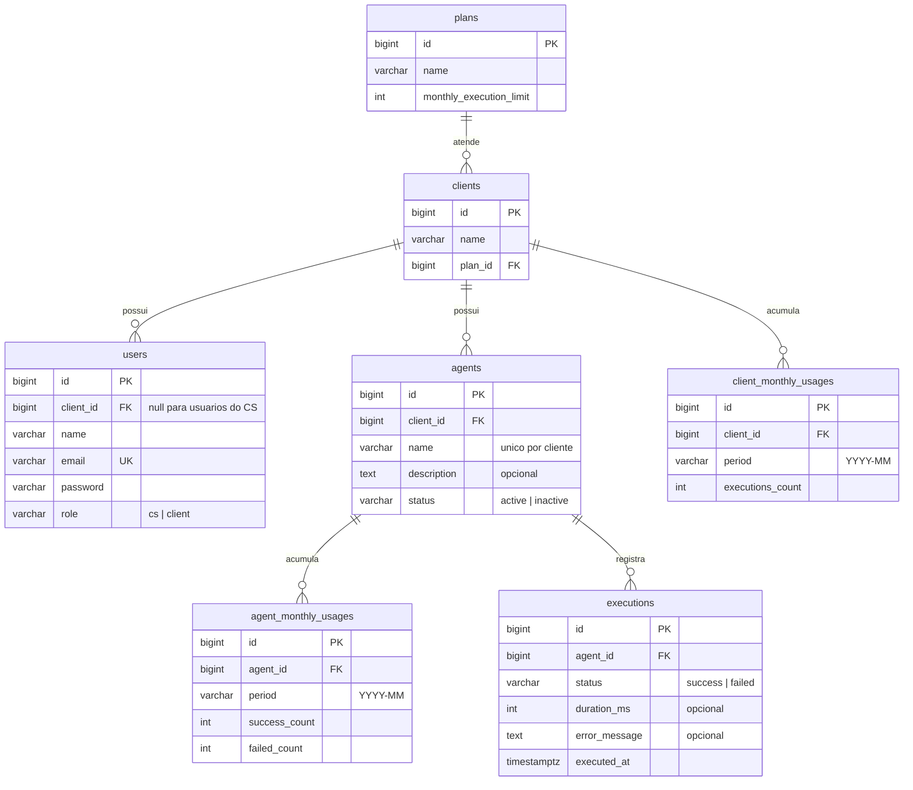

# Rotik Agent Monitor

Painel de monitoramento de agentes de IA, construído como desafio técnico fullstack para Rotik.

A ideia é dar visibilidade, por cliente, sobre quais agentes estão ativos e quanto cada um executou no mês, além de garantir a regra central do negócio: quando o cliente atinge o limite mensal de execuções do plano, novas execuções são bloqueadas e isso fica visível para o time.

---

## Etapa 0: Discovery

O briefing é intencionalmente incompleto, então antes de escrever qualquer código registrei aqui as perguntas que eu faria ao time de Produto, a suposição que adotei para cada uma na ausência de resposta, e o recorte de escopo do MVP.

### Perguntas ao stakeholder e suposições adotadas

**1. O limite mensal de execuções é por cliente (somando todos os agentes) ou por agente?**
O briefing diz "limite de execuções do plano contratado", e quem contrata plano é o cliente, não o agente. **Suposição: o limite é por cliente.** Todos os agentes de um cliente consomem a mesma cota mensal. A modelagem, porém, registra execuções por agente. Se um dia o limite passar a ser por agente, a mudança fica concentrada na regra de consumo, sem mexer no modelo de dados.

**2. Ao estourar o limite, o agente deve parar de responder de fato ou basta sinalizar?**
O briefing hesita nesse ponto ("deveria parar de responder, ou pelo menos a gente precisa saber"). **Suposição: bloqueio efetivo.** A API recusa novas execuções com HTTP 429, registra log da ação de bloqueio e o painel sinaliza visualmente. Escolhi o comportamento mais restritivo porque o custo de errar para o outro lado é maior: execução de agente de IA custa dinheiro (tokens, infra), e um cliente estourando o plano sem bloqueio é prejuízo direto. Se Produto decidir depois por um modo que apenas alerta, isso vira uma flag no plano.

**3. O que conta como "execução"? Chamadas que falham consomem cota?**
**Suposição: apenas execuções concluídas com sucesso consomem cota.** Existe custo para a empresa mesmo quando a chamada falha (tokens, infra), mas repassar isso para o cliente seria penalizá-lo por uma falha que muitas vezes é do próprio sistema, e a satisfação dele pesa mais aqui. As falhas continuam registradas no histórico com status `failed`, então seguem visíveis para o diagnóstico do CS. Se Produto mudar essa regra no futuro, o dado já existe para recalcular.

**4. Quem usa o painel: o time interno de CS (vendo todos os clientes) ou o cliente final?**
O briefing explicita que a dor atual é do time interno, que hoje depende de planilhas e logs brutos, e pede que a ferramenta seja "fácil de usar pelo nosso time de CS". Porém, na parte técnica, exige que "um cliente não possa ver dados de outro". **Suposição: o frontend do MVP foca na visão do CS, mas a API nasce multi-tenant e segura.** Para resolver essa tensão, a API implementa autorização rigorosa baseada no token, garantindo o isolamento entre clientes exigido no desafio: um token de cliente só enxerga os dados do próprio cliente. A interface, por sua vez, consome essa API com um perfil de privilégios de CS, que pode selecionar e alternar entre clientes para diagnosticar problemas. Isso resolve a dor de negócio imediata do time interno e deixa a fundação pronta e segura para expor o painel aos clientes finais no futuro.

**5. Quando o contador mensal zera? Em qual fuso horário?**
**Suposição: mês-calendário em UTC.** O consumo de julho vai de 01/07 00:00 UTC a 31/07 23:59 UTC. É o recorte mais simples e auditável. O cálculo do período fica isolado em um único ponto do código, então adotar depois o fuso do cliente ou o ciclo de faturamento (dia da contratação) não espalha mudança pelo sistema.

**6. O que significa "perto de estourar o limite"? Existe um threshold definido?**
**Suposição: 80% da cota** marca o estado de atenção no painel, que é um padrão comum de mercado para alertas de consumo. No MVP o alerta é visual (badge e cor na listagem). Notificação ativa por e-mail ou Slack fica fora do escopo.

**7. Quem registra a execução? Os agentes rodam em outra parte da plataforma e chamam esta API?**
**Suposição: sim. Este sistema não executa agentes, apenas registra e contabiliza execuções.** O runtime dos agentes (fictício aqui) chamaria `POST /agents/{id}/executions` a cada chamada, e é essa rota que aplica a regra de bloqueio. Para fins de demonstração, a execução pode ser disparada pela própria UI.

**8. Planos podem ser criados e alterados pelo painel? E upgrade no meio do mês?**
**Suposição: planos são um catálogo fixo** (seed com Starter, Pro e Enterprise), sem CRUD. Gestão de planos é problema de billing, não deste painel. Se o cliente trocar de plano no meio do mês, o limite considerado é sempre o do plano atual no momento da execução, sem pró-rata. É a regra mais simples e a mais favorável ao cliente.

### Entidades e conceitos identificados

| Entidade | Papel |
|---|---|
| **Cliente** | Empresa que contrata a Rotik; dona dos agentes e do plano |
| **Plano** | Define o limite mensal de execuções (Starter, Pro, Enterprise) |
| **Usuário** | Pessoa que acessa o sistema. Pode ser do time interno (CS, enxerga qualquer cliente) ou de um cliente (enxerga apenas o próprio) |
| **Agente** | Agente de IA cadastrado para um cliente; tem status (ativo, inativo, bloqueado) |
| **Execução** | Uma chamada de um agente; tem status e timestamp; consome cota quando bem-sucedida |
| **Uso mensal** | Consumo agregado do cliente no mês corrente contra o limite do plano |
| **Bloqueio** | Estado derivado: uso mensal maior ou igual ao limite, novas execuções recusadas |

### Escopo do MVP

**Dentro:**
- Autenticação por token com dois perfis: CS (acessa qualquer cliente) e usuário de cliente (acessa apenas o próprio, isolamento garantido por Policies e coberto por testes)
- Painel na visão do CS, com seletor para alternar entre clientes
- Cadastro e listagem de agentes com consumo do mês contra o limite do plano
- Registro de execução com a regra de bloqueio por limite (regra central do desafio)
- Histórico de execuções por agente, paginado
- Indicação visual de consumo (barra de uso, alerta aos 80%, badge de bloqueado)
- Seeds com dados realistas para demonstração

**Fora (e por quê):**
- Painel na visão do cliente final: a API já suporta e testa esse perfil, mas a dor descrita no briefing é do time interno, então a UI do MVP atende o CS
- Notificações ativas (e-mail, Slack): o alerta visual no painel resolve o problema imediato
- Gestão de planos, billing, pró-rata de upgrade: domínio de faturamento, não de monitoramento
- Execução real de agentes de IA: o sistema contabiliza execuções, não as processa
- Créditos extras e reset manual de cota: decisão comercial que ainda não existe

### Riscos e ambiguidades deliberadamente não resolvidos

- **Volume da tabela de execuções.** Com muitos clientes, `executions` cresce rápido. O consumo mensal já é lido de um contador agregado, sem `COUNT(*)` em tempo real, então a leitura não degrada. Particionamento e política de retenção ficam para quando houver volume real; resolver isso agora seria otimização prematura.
- **Fuso horário e ciclo de faturamento.** O recorte UTC por mês-calendário pode não bater com o ciclo comercial. Como o cálculo do período é um ponto único no código, o risco é baixo e a correção é barata.
- **Semântica exata do bloqueio para o cliente final.** Bloquear execução de um agente em produção do cliente é decisão sensível de produto, porque pode quebrar o atendimento dele. Adotei o bloqueio hard documentado, mas numa empresa real essa decisão sairia de uma conversa com Produto e Comercial, não do dev.
- **Autenticação simplificada.** Tokens de API sem expiração, refresh ou 2FA. Suficiente para o desafio e explicitamente aceito pelo enunciado. Já a fronteira de autorização (isolamento entre clientes) é tratada como requisito real, com testes.

---

## Etapa 1: Modelagem de dados

### Diagrama ER

### Decisões de modelagem

**O limite mora no plano, o consumo mora no cliente.** O modelo segue a terceira forma normal: o limite mensal é atributo do plano e não é duplicado em lugar nenhum. Cliente aponta para plano, agente aponta para cliente, execução aponta para agente. Com isso, a troca de plano de um cliente é um update de uma única coluna, e o limite considerado passa a ser o novo automaticamente (coerente com a suposição 8 do Discovery).

**Uso mensal: contador agregado, não contagem em tempo real.** A pergunta "quantas execuções o cliente já fez este mês?" é a mais frequente do sistema, consultada a cada execução e a cada carregamento do painel. Responder com `COUNT(*)` sobre `executions` funciona no começo, mas degrada linearmente com o volume (um cliente Enterprise pode gerar milhões de linhas por mês). Por isso existe `client_monthly_usages`: uma linha por cliente por mês (`UNIQUE(client_id, period)`), com o contador incrementado de forma atômica na mesma transação que registra a execução. A leitura do consumo vira a busca de uma única linha, custo constante. É uma desnormalização deliberada e segura: `executions` continua sendo a fonte da verdade, então o contador pode ser auditado ou reconstruído a qualquer momento a partir dela.

**O consumo por agente também é contador, pelo mesmo motivo.** O painel lista os agentes de um cliente com o consumo de cada um no mês, então essa leitura é tão frequente quanto a do total. `agent_monthly_usages` guarda uma linha por agente por mês, com sucessos e falhas separados. O total de falhas no mês ainda dá ao CS um sinal barato de agente problemático, sem varrer o histórico. São dois contadores atualizados na mesma transação: o do cliente responde "pode executar?" e o do agente responde "quanto cada um consumiu?".

**A verificação do limite acontece dentro da transação, com lock de linha.** O cenário perigoso é o de corrida: o cliente está a uma execução do limite e duas chegam ao mesmo tempo. Se cada uma ler o contador antes da outra gravar, as duas passam. Para impedir isso, o registro roda em transação que trava a linha do contador mensal do cliente (upsert com lock), compara com o limite do plano e só então grava a execução e incrementa os contadores. Uma das duas requisições concorrentes espera a outra terminar e é recusada corretamente. Como a transação toca duas linhas de contador, a ordem de escrita é fixa (sempre cliente, depois agente), o que elimina a chance de deadlock entre execuções concorrentes. Esse comportamento é o coração do desafio e terá teste de concorrência dedicado.

**Bloqueio é estado derivado, não coluna.** Um agente está bloqueado quando o consumo do mês do seu cliente atinge o limite do plano. Guardar isso numa coluna `blocked` criaria uma segunda fonte de verdade e exigiria um job para desbloquear todo mundo na virada do mês (e um bug nesse job deixaria cliente pagante bloqueado indevidamente). Derivando o estado na leitura, a virada do mês zera o consumo naturalmente, porque o período novo ainda não tem linha de contador. A coluna `status` do agente guarda apenas o que é decisão do usuário: `active` ou `inactive`.

**Execuções com falha ficam no histórico, fora da cota.** O incremento do contador só acontece quando a execução tem status `success` (suposição 3 do Discovery). A tabela `executions` registra as falhas do mesmo jeito, com `error_message` e `duration_ms`, porque são exatamente o que o CS precisa enxergar para diagnosticar problema de agente.

**Usuários e perfis.** `role` distingue `cs` de `client`. Usuário do CS tem `client_id` nulo e enxerga qualquer cliente; usuário de cliente tem `client_id` obrigatório e as Policies restringem tudo ao próprio cliente. Preferi uma coluna explícita a inferir o perfil pela nulidade do `client_id`, porque intenção explícita facilita leitura e evita gambiarra quando surgir um terceiro perfil.

**Integridade garantida no banco, não só na aplicação.** A validação de entrada barra dado ruim na porta, mas o banco é a última linha de defesa contra bug de aplicação: `CHECK` garante a coerência entre `role` e `client_id` (CS sem cliente, usuário de cliente com cliente obrigatório) e restringe os valores de `status` nas tabelas que o usam. Nome de agente é único por cliente, porque dois agentes homônimos no mesmo cliente só geram confusão para o CS.

**Índices e constraints relevantes:**

| Índice / constraint | Sustenta |
|---|---|
| `executions(agent_id, executed_at DESC)` | Histórico paginado do agente, já na ordem exibida |
| `client_monthly_usages UNIQUE(client_id, period)` | Leitura O(1) do consumo do cliente e alvo do upsert atômico |
| `agent_monthly_usages UNIQUE(agent_id, period)` | Leitura O(1) do consumo por agente na listagem do painel |
| `agents(client_id)` + `UNIQUE(client_id, name)` | Listagem por cliente e nome sem duplicata dentro do cliente |
| `users(email) UNIQUE` | Login |
| `CHECK role/client_id em users` | CS sem vínculo, usuário de cliente sempre vinculado |

---

*As próximas seções (execução do projeto, decisões de arquitetura e respostas de produto) serão adicionadas conforme as etapas avançam.*
