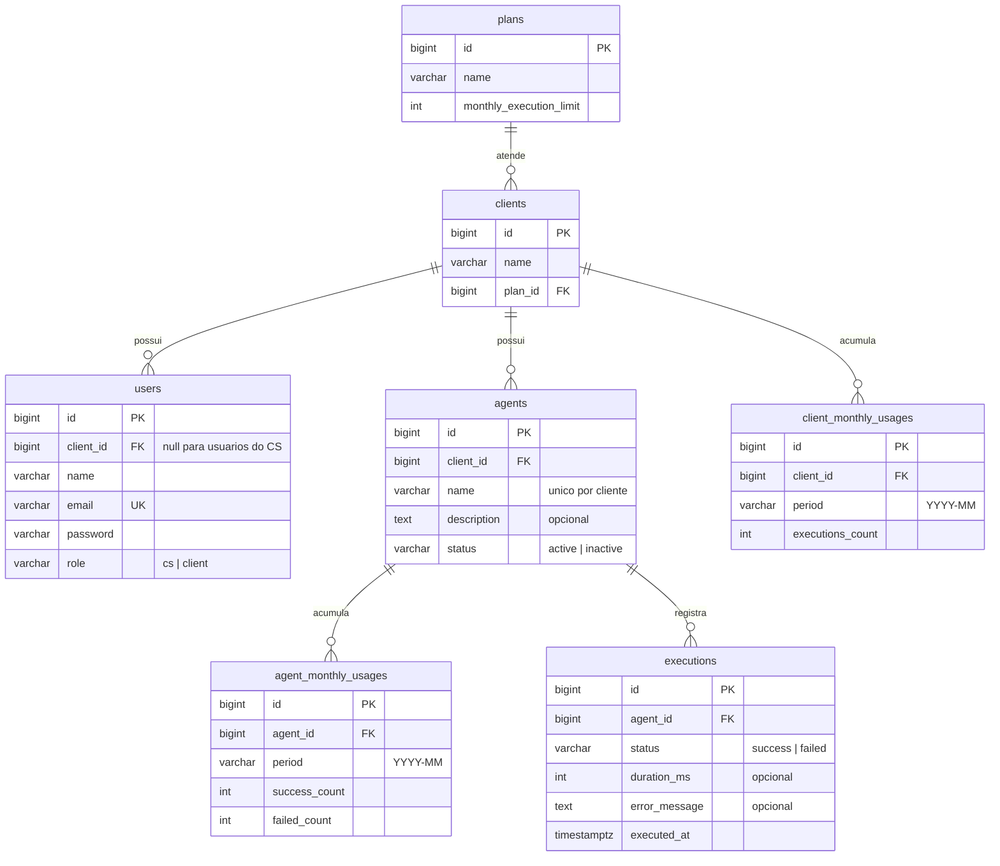

# Rotik Agent Monitor

Painel de monitoramento de agentes de IA, construído como desafio técnico fullstack para Rotik.

A ideia é dar visibilidade, por cliente, sobre quais agentes estão ativos e quanto cada um executou no mês, além de garantir a regra central do negócio: quando o cliente atinge o limite mensal de execuções do plano, novas execuções são bloqueadas e isso fica visível para o time.

## Demo ao vivo

- Frontend: https://rotik-agent-monitor.vercel.app
- API: https://rotik-agent-monitor.onrender.com

Entre com `cs@rotik.com` / `password` (perfil do time interno, enxerga todos os clientes). Os demais logins de demonstração estão na seção de execução local, mais abaixo.

> O backend roda no plano gratuito do Render, que hiberna após um tempo sem uso. O primeiro acesso pode levar cerca de 30 segundos para o serviço acordar; os seguintes ficam normais.

---

## Etapa 0: Discovery

O briefing é intencionalmente incompleto, então antes de escrever qualquer código registrei aqui as perguntas que eu faria ao time de Produto, a suposição que adotei para cada uma na ausência de resposta, e o recorte de escopo do MVP.

### Perguntas ao stakeholder e suposições adotadas

**1. O limite mensal de execuções é por cliente (somando todos os agentes) ou por agente?**
O briefing diz "limite de execuções do plano contratado", e quem contrata plano é o cliente, não o agente. **Suposição: o limite é por cliente.** Todos os agentes de um cliente consomem a mesma cota mensal. A modelagem, porém, registra execuções por agente. Se um dia o limite passar a ser por agente, a mudança fica concentrada na regra de consumo, sem mexer no modelo de dados.

**2. Ao estourar o limite, o agente deve parar de responder de fato ou basta sinalizar?**
O briefing hesita nesse ponto ("deveria parar de responder, ou pelo menos a gente precisa saber"). **Suposição: bloqueio efetivo.** A API recusa novas execuções com HTTP 429, registra log da ação de bloqueio e o painel sinaliza visualmente. Escolhi o comportamento mais restritivo porque o custo de errar para o outro lado é maior: execução de agente de IA custa dinheiro (tokens, infra), e um cliente estourando o plano sem bloqueio é prejuízo direto. Se Produto decidir depois por um modo que apenas alerta, isso vira uma flag no plano.

**3. O que conta como "execução"? Chamadas que falham consomem cota?**
**Suposição: apenas execuções concluídas com sucesso consomem cota.** Existe custo para a empresa mesmo quando a chamada falha (tokens, infra), mas repassar isso para o cliente seria penalizá-lo por uma falha que muitas vezes é do próprio sistema, e a satisfação dele pesa mais aqui. As falhas continuam registradas no histórico com status `failed`, então seguem visíveis para o diagnóstico do CS. Se Produto mudar essa regra no futuro, o dado já existe para recalcular.

**4. Quem usa o painel: o time interno de CS (vendo todos os clientes) ou o cliente final?**
O briefing explicita que a dor atual é do time interno, que hoje depende de planilhas e logs brutos, e pede que a ferramenta seja "fácil de usar pelo nosso time de CS". Porém, na parte técnica, exige que "um cliente não possa ver dados de outro". **Suposição: o frontend do MVP foca na visão do CS, mas a API nasce multi-tenant e segura.** Para resolver essa tensão, a API implementa autorização rigorosa baseada no token, garantindo o isolamento entre clientes exigido no desafio: um token de cliente só enxerga os dados do próprio cliente. A interface, por sua vez, consome essa API com um perfil de privilégios de CS, que pode selecionar e alternar entre clientes para diagnosticar problemas. Isso resolve a dor de negócio imediata do time interno e deixa a fundação pronta e segura para expor o painel aos clientes finais no futuro.

**5. Quando o contador mensal zera? Em qual fuso horário?**
**Suposição: mês-calendário em UTC.** O consumo de julho vai de 01/07 00:00 UTC a 31/07 23:59 UTC. É o recorte mais simples e auditável. O cálculo do período fica isolado em um único ponto do código, então adotar depois o fuso do cliente ou o ciclo de faturamento (dia da contratação) não espalha mudança pelo sistema.

**6. O que significa "perto de estourar o limite"? Existe um threshold definido?**
**Suposição: 80% da cota** marca o estado de atenção no painel, que é um padrão comum de mercado para alertas de consumo. No MVP o alerta é visual (badge e cor na listagem). Notificação ativa por e-mail ou Slack fica fora do escopo.

**7. Quem registra a execução? Os agentes rodam em outra parte da plataforma e chamam esta API?**
**Suposição: sim. Este sistema não executa agentes, apenas registra e contabiliza execuções.** O runtime dos agentes (fictício aqui) chamaria `POST /agents/{id}/executions` a cada chamada, e é essa rota que aplica a regra de bloqueio. Para fins de demonstração, a execução pode ser disparada pela própria UI.

**8. Planos podem ser criados e alterados pelo painel? E upgrade no meio do mês?**
**Suposição: planos são um catálogo fixo** (seed com Starter, Pro e Enterprise), sem CRUD. Gestão de planos é problema de billing, não deste painel. Se o cliente trocar de plano no meio do mês, o limite considerado é sempre o do plano atual no momento da execução, sem pró-rata. É a regra mais simples e a mais favorável ao cliente.

### Entidades e conceitos identificados

| Entidade | Papel |
|---|---|
| **Cliente** | Empresa que contrata a Rotik; dona dos agentes e do plano |
| **Plano** | Define o limite mensal de execuções (Starter, Pro, Enterprise) |
| **Usuário** | Pessoa que acessa o sistema. Pode ser do time interno (CS, enxerga qualquer cliente) ou de um cliente (enxerga apenas o próprio) |
| **Agente** | Agente de IA cadastrado para um cliente; tem status (ativo, inativo, bloqueado) |
| **Execução** | Uma chamada de um agente; tem status e timestamp; consome cota quando bem-sucedida |
| **Uso mensal** | Consumo agregado do cliente no mês corrente contra o limite do plano |
| **Bloqueio** | Estado derivado: uso mensal maior ou igual ao limite, novas execuções recusadas |

### Escopo do MVP

**Dentro:**
- Autenticação por token com dois perfis: CS (acessa qualquer cliente) e usuário de cliente (acessa apenas o próprio, isolamento garantido por Policies e coberto por testes)
- Painel na visão do CS, com seletor para alternar entre clientes
- Cadastro e listagem de agentes com consumo do mês contra o limite do plano
- Registro de execução com a regra de bloqueio por limite (regra central do desafio)
- Histórico de execuções por agente, paginado
- Indicação visual de consumo (barra de uso, alerta aos 80%, badge de bloqueado)
- Seeds com dados realistas para demonstração

**Fora (e por quê):**
- Painel na visão do cliente final: a API já suporta e testa esse perfil, mas a dor descrita no briefing é do time interno, então a UI do MVP atende o CS
- Notificações ativas (e-mail, Slack): o alerta visual no painel resolve o problema imediato
- Gestão de planos, billing, pró-rata de upgrade: domínio de faturamento, não de monitoramento
- Execução real de agentes de IA: o sistema contabiliza execuções, não as processa
- Créditos extras e reset manual de cota: decisão comercial que ainda não existe

### Riscos e ambiguidades deliberadamente não resolvidos

- **Volume da tabela de execuções.** Com muitos clientes, `executions` cresce rápido. O consumo mensal já é lido de um contador agregado, sem `COUNT(*)` em tempo real, então a leitura não degrada. Particionamento e política de retenção ficam para quando houver volume real; resolver isso agora seria otimização prematura.
- **Fuso horário e ciclo de faturamento.** O recorte UTC por mês-calendário pode não bater com o ciclo comercial. Como o cálculo do período é um ponto único no código, o risco é baixo e a correção é barata.
- **Semântica exata do bloqueio para o cliente final.** Bloquear execução de um agente em produção do cliente é decisão sensível de produto, porque pode quebrar o atendimento dele. Adotei o bloqueio hard documentado, mas numa empresa real essa decisão sairia de uma conversa com Produto e Comercial, não do dev.
- **Autenticação simplificada.** Tokens de API sem expiração, refresh ou 2FA. Suficiente para o desafio e explicitamente aceito pelo enunciado. Já a fronteira de autorização (isolamento entre clientes) é tratada como requisito real, com testes.

---

## Etapa 1: Modelagem de dados

### Diagrama ER



### Decisões de modelagem

**O limite mora no plano, o consumo mora no cliente.** O modelo segue a terceira forma normal: o limite mensal é atributo do plano e não é duplicado em lugar nenhum. Cliente aponta para plano, agente aponta para cliente, execução aponta para agente. Com isso, a troca de plano de um cliente é um update de uma única coluna, e o limite considerado passa a ser o novo automaticamente (coerente com a suposição 8 do Discovery).

**Uso mensal: contador agregado, não contagem em tempo real.** A pergunta "quantas execuções o cliente já fez este mês?" é a mais frequente do sistema, consultada a cada execução e a cada carregamento do painel. Responder com `COUNT(*)` sobre `executions` funciona no começo, mas degrada linearmente com o volume (um cliente Enterprise pode gerar milhões de linhas por mês). Por isso existe `client_monthly_usages`: uma linha por cliente por mês (`UNIQUE(client_id, period)`), com o contador incrementado de forma atômica na mesma transação que registra a execução. A leitura do consumo vira a busca de uma única linha, custo constante. É uma desnormalização deliberada e segura: `executions` continua sendo a fonte da verdade, então o contador pode ser auditado ou reconstruído a qualquer momento a partir dela.

**O consumo por agente também é contador, pelo mesmo motivo.** O painel lista os agentes de um cliente com o consumo de cada um no mês, então essa leitura é tão frequente quanto a do total. `agent_monthly_usages` guarda uma linha por agente por mês, com sucessos e falhas separados. O total de falhas no mês ainda dá ao CS um sinal barato de agente problemático, sem varrer o histórico. São dois contadores atualizados na mesma transação: o do cliente responde "pode executar?" e o do agente responde "quanto cada um consumiu?".

**A verificação do limite acontece dentro da transação, com lock de linha.** O cenário perigoso é o de corrida: o cliente está a uma execução do limite e duas chegam ao mesmo tempo. Se cada uma ler o contador antes da outra gravar, as duas passam. Para impedir isso, o registro roda em transação que trava a linha do contador mensal do cliente (upsert com lock), compara com o limite do plano e só então grava a execução e incrementa os contadores. Uma das duas requisições concorrentes espera a outra terminar e é recusada corretamente. Como a transação toca duas linhas de contador, a ordem de escrita é fixa (sempre cliente, depois agente), o que elimina a chance de deadlock entre execuções concorrentes. Esse comportamento é o coração do desafio e terá teste de concorrência dedicado.

**Bloqueio é estado derivado, não coluna.** Um agente está bloqueado quando o consumo do mês do seu cliente atinge o limite do plano. Guardar isso numa coluna `blocked` criaria uma segunda fonte de verdade e exigiria um job para desbloquear todo mundo na virada do mês (e um bug nesse job deixaria cliente pagante bloqueado indevidamente). Derivando o estado na leitura, a virada do mês zera o consumo naturalmente, porque o período novo ainda não tem linha de contador. A coluna `status` do agente guarda apenas o que é decisão do usuário: `active` ou `inactive`.

**Execuções com falha ficam no histórico, fora da cota.** O incremento do contador só acontece quando a execução tem status `success` (suposição 3 do Discovery). A tabela `executions` registra as falhas do mesmo jeito, com `error_message` e `duration_ms`, porque são exatamente o que o CS precisa enxergar para diagnosticar problema de agente.

**Usuários e perfis.** `role` distingue `cs` de `client`. Usuário do CS tem `client_id` nulo e enxerga qualquer cliente; usuário de cliente tem `client_id` obrigatório e as Policies restringem tudo ao próprio cliente. Preferi uma coluna explícita a inferir o perfil pela nulidade do `client_id`, porque intenção explícita facilita leitura e evita gambiarra quando surgir um terceiro perfil.

**Integridade garantida no banco, não só na aplicação.** A validação de entrada barra dado ruim na porta, mas o banco é a última linha de defesa contra bug de aplicação: `CHECK` garante a coerência entre `role` e `client_id` (CS sem cliente, usuário de cliente com cliente obrigatório) e restringe os valores de `status` nas tabelas que o usam. Nome de agente é único por cliente, porque dois agentes homônimos no mesmo cliente só geram confusão para o CS.

**Índices e constraints relevantes:**

| Índice / constraint | Sustenta |
|---|---|
| `executions(agent_id, executed_at)` | Histórico paginado do agente, ordenado pela data de execução |
| `client_monthly_usages UNIQUE(client_id, period)` | Leitura O(1) do consumo do cliente e alvo do upsert atômico |
| `agent_monthly_usages UNIQUE(agent_id, period)` | Leitura O(1) do consumo por agente na listagem do painel |
| `agents(client_id)` + `UNIQUE(client_id, name)` | Listagem por cliente e nome sem duplicata dentro do cliente |
| `users(email) UNIQUE` | Login |
| `CHECK role/client_id em users` | CS sem vínculo, usuário de cliente sempre vinculado |

---

## Etapa 2: Backend

### Como rodar a API localmente

Pré-requisitos: PHP 8.4 com pdo_pgsql, Composer e Docker.

```bash
docker compose up -d          # Postgres 17 (cria também a base de testes)
cd backend
composer install
cp .env.example .env
php artisan key:generate
php artisan migrate --seed
php artisan serve             # API em http://127.0.0.1:8000/api
```

Se a porta 5432 já estiver em uso na sua máquina, crie um `.env` na raiz do repositório com `DB_PORT=5433` (o compose lê essa variável) e ajuste o mesmo valor no `backend/.env`.

Usuários do seed, todos com senha `password`:

| Email | Perfil |
|---|---|
| `cs@rotik.com` | Time interno (CS), enxerga todos os clientes |
| `ana@acme.com` | Cliente Acme Atendimentos (Pro, consumo saudável) |
| `bruno@betalogistica.com` | Cliente Beta Logística (Starter, 85% da cota, em alerta) |
| `carla@gamafintech.com` | Cliente Gama Fintech (Starter, 100% da cota, bloqueada) |

Testes: `php artisan test`. A suíte roda contra a base separada `rotik_monitor_test` (criada pelo init script do container), então os dados de demonstração não são afetados. O teste de concorrência exige a extensão pcntl e um Postgres real, motivo pelo qual os testes não usam sqlite.

### Autenticação e perfis

Sanctum com tokens de API: `POST /api/auth/login` devolve o token que vai no header `Authorization: Bearer`. Existem dois perfis, `cs` (time interno, acessa qualquer cliente) e `client` (usuário de um cliente, acessa apenas o próprio). O login tem limite de 5 tentativas por minuto por IP, e a mensagem de credencial inválida não revela se o email existe na base.

Simplificações conscientes, aceitas pelo enunciado: tokens sem expiração ou refresh e sem 2FA. Já o isolamento entre clientes é tratado como requisito real: toda rota passa por Policy, e o acesso a recurso de outro cliente responde **404 em vez de 403**, para não revelar nem a existência do recurso. Os testes cobrem o isolamento nas duas direções (leitura e escrita).

### Endpoints

| Método e rota | Quem acessa | O que faz |
|---|---|---|
| `POST /api/auth/login` | Público (com throttle) | Autentica e devolve token + perfil |
| `GET /api/auth/me` | Autenticado | Identifica o dono do token |
| `POST /api/auth/logout` | Autenticado | Revoga o token atual |
| `GET /api/clients` | Só CS | Lista clientes para o seletor do painel |
| `GET /api/clients/{id}/agents` | CS ou o próprio cliente | Agentes com consumo do mês por agente + resumo do cliente (usado, limite, percentual, bloqueio) |
| `POST /api/clients/{id}/agents` | CS ou o próprio cliente | Cadastra agente (nome único por cliente) |
| `POST /api/agents/{id}/executions` | CS ou o próprio cliente | Registra execução aplicando a regra de bloqueio |
| `GET /api/agents/{id}/executions` | CS ou o próprio cliente | Histórico paginado, do mais recente para o mais antigo (`page`, `per_page` de 1 a 100) |

Todo endpoint que recebe dados valida a entrada via Form Request, inclusive os parâmetros de paginação.

### A regra de bloqueio na prática

`POST /api/agents/{id}/executions` roda dentro de uma transação que trava a linha do contador mensal do cliente antes de comparar com o limite do plano. Com isso, duas execuções simultâneas disputando a última vaga não passam juntas: uma espera o lock e é recusada. Esse cenário tem teste dedicado que dispara dois processos reais com `pcntl_fork`. A recusa responde **429**, registra log de warning com cliente, agente, período e limite, e não grava nada. Execução com falha entra no histórico com a mensagem de erro, mas não consome cota. Agente inativo responde **409**.

### Formato de erros

Toda resposta de erro da API é JSON com uma chave `message` em português, sem stack trace nem detalhe interno (nomes de classes, SQL). Erros de validação incluem também o objeto `errors` campo a campo.

| Código | Quando |
|---|---|
| 401 | Sem token ou token revogado |
| 403 | Autenticado, mas sem permissão para a ação (ex.: usuário de cliente listando todos os clientes) |
| 404 | Recurso inexistente ou pertencente a outro cliente |
| 409 | Execução em agente inativo |
| 422 | Erro de validação, com detalhe por campo |
| 429 | Limite mensal do plano atingido, ou excesso de tentativas de login |
| 500 | Erro interno, mensagem genérica (detalhe fica só no log do servidor) |

---

## Etapa 3: Frontend

SPA em React 19 + TypeScript + Vite + Tailwind CSS v4, consumindo a API real (sem mock). Rodar localmente:

```bash
cd frontend
npm install
npm run dev
```

O Vite sobe em `http://localhost:5173` e faz proxy de `/api` para `http://127.0.0.1:8000`, então basta ter o backend rodando. Use os mesmos logins do seed (senha `password`); comece por `cs@rotik.com` para ver o seletor de clientes.

### Organização e escolhas

- **Componentização por domínio:** `src/features/{auth,clients,agents,executions,dashboard}` para a lógica de cada área, `src/components/ui` para os primitivos reutilizáveis (Button, Card, Badge, Modal, Drawer, etc.) e `src/lib` para infraestrutura (cliente HTTP, formatação). Nada de arquivo gigante: o orquestrador da tela, `DashboardPage.tsx`, delega para componentes pequenos.
- **Gerenciamento de estado, três camadas:** estado de servidor no **TanStack Query** (cache, loading, erro, revalidação e paginação de agentes e execuções); estado global de aplicação em **Context** (`AuthProvider` para o usuário logado, `ToastProvider` para notificações); estado local de UI em `useState` (modal aberto, página atual, campos de formulário). Não usei Redux/Zustand porque o estado verdadeiramente global é mínimo e a maior parte é dado de servidor, para o qual o TanStack Query já é a ferramenta certa.
- **Consumo com resiliência:** timeout no axios, retry automático do TanStack Query, e um interceptor que desloga em 401. Erros de carregamento viram banner com "tentar de novo"; erros de ação viram toast.
- **Acessibilidade e responsividade:** HTML semântico, `aria` no medidor e nos diálogos, foco visível, `Esc` fecha modal e drawer, layout mobile-first (topbar colapsa, grade de 1 a 3 colunas).
- **Regra de negócio visível:** o medidor de consumo (`UsageMeter.tsx`) muda de cor a partir de 80% e fica vermelho no bloqueio; agentes de um cliente no limite ganham selo "Bloqueado". Registrar uma execução em um cliente no limite dispara o 429 e mostra o aviso na tela, tornando a regra tangível.

---

## Notas de debug

Registro aqui bugs reais encontrados durante o desenvolvimento e como foram resolvidos, conforme a Etapa 5.

### 1. Logout sem token retornava 500 em vez de 401

**Sintoma.** Ao chamar `POST /api/auth/logout` sem token e sem o header `Accept: application/json`, a API respondia HTTP 500 com "Route [login] not defined", em vez de um 401 limpo.

**Investigação.** O log apontava `RouteNotFoundException` vindo do `UrlGenerator`. O middleware `Authenticate` do Laravel, quando julga que a requisição não espera JSON, tenta redirecionar o visitante não autenticado para a rota de nome `login`. Numa API pura essa rota não existe, então a geração da URL estourava antes mesmo de o handler decidir o formato da resposta. O `GET /me` não caía nisso porque a chamada de teste enviava `Accept: application/json`; o `logout` sem esse header revelou o buraco.

**Correção.** Desliguei o redirecionamento de visitantes em `backend/bootstrap/app.php` com `$middleware->redirectGuestsTo(fn () => null)`, o que faz o middleware devolver 401 direto. Adicionei um teste (`AuthenticationTest::test_rota_protegida_sem_token_devolve_401_mesmo_sem_pedir_json`) reproduzindo o cenário exato, sem o header, para travar a regressão.

**Lição.** Testar rotas de API também sem o header `Accept`, porque nem todo cliente HTTP o envia, e é justamente aí que o comportamento de fallback aparece.

### 2. Testes da regra central falhando por isolamento entre estratégias de banco

**Sintoma.** Dois testes da regra de bloqueio falhavam de forma intermitente com contagens maiores que o esperado (por exemplo, 4 execuções onde se esperava 3).

**Investigação.** O teste de concorrência precisa de commits reais no banco para que os processos filhos (`pcntl_fork`) enxerguem os dados, então ele usa `DatabaseTruncation`. Os demais testes usam `RefreshDatabase`, que roda dentro de uma transação e faz rollback ao final. Por ordem alfabética, o teste de concorrência rodava antes e deixava uma linha commitada que o rollback dos outros não limpava.

**Correção.** Troquei as asserções que dependiam de contagem global de tabela por asserções escopadas ao agente do próprio teste (`$agent->executions()->count()` em vez de `assertDatabaseCount('executions', ...)`), tornando cada teste independente do estado deixado por outro.

**Lição.** Misturar estratégias de banco na mesma suíte quebra a suposição de isolamento; as asserções precisam ser específicas do que aquele teste criou.

---

## Etapa 6: DevOps

### Integração contínua

O workflow `.github/workflows/ci.yml` roda a cada push e pull request na `main`, com dois jobs: o de backend sobe um Postgres de serviço, instala o PHP com a extensão `pcntl` e executa o lint (Pint) e a suíte de testes; o de frontend roda o lint (oxlint) e o build. Nenhuma mudança entra sem passar por lint e testes.

### Deploy

- **Backend e banco no Render.** A API roda como serviço Docker (`backend/Dockerfile`) e o Postgres é gerenciado pelo Render. No boot, o container aplica as migrations e o seed de demonstração. Toda a configuração vem de variáveis de ambiente (`APP_KEY`, `DB_URL`, `CORS_ALLOWED_ORIGINS`, entre outras), nada hardcoded.
- **Frontend na Vercel.** Build estático do Vite, com a URL da API injetada pela variável `VITE_API_URL`.

### Logs

O backend registra, no mínimo:

- **Ação de bloqueio por limite.** Cada recusa por cota atingida emite um `Log::warning` com `client_id`, `agent_id`, período e limite (em `ExecutionRecorder`), para o time rastrear quem está batendo no teto do plano.
- **Erros de servidor.** Exceções não tratadas são logadas pelo Laravel. Em produção a resposta ao cliente é genérica, sem vazar detalhe interno, e o detalhe fica só no log.

### Como eu monitoraria em produção

Não implementado, conforme o enunciado. Descrição do que eu acompanharia e por quê:

- **Taxa de execuções bloqueadas por limite** (a partir dos warnings de bloqueio, por cliente e por período). É o sinal de negócio mais direto: mostra ao Comercial quais contas estão batendo no teto e são candidatas a upgrade, e ao CS quais clientes podem estar com o atendimento interrompido.
- **Latência e taxa de erro (5xx) da API, por rota.** A rota de registro de execução é a mais crítica, porque roda em transação com trava de linha; latência subindo ali indica contenção no banco, e 5xx indica regressão ou saturação.
- **Taxa de falha das execuções por agente** (proporção de `failed` sobre o total no mês). Aponta agente problemático para o CS agir, sem varrer o histórico.
- **Saúde do PostgreSQL:** conexões ativas, uso de CPU e memória, e o crescimento da tabela `executions`, que é a que mais cresce e o gatilho para pensar em particionamento e retenção.
- **Disponibilidade e tempo de resposta do health check,** com alerta se a API sair do ar.

Os logs estruturados do Laravel já dão a base. Em produção eu os enviaria para um agregador (Grafana Loki, Datadog ou o próprio painel do Render) e montaria alertas sobre a taxa de bloqueios e de erros 5xx.

---

## Etapa 7: Mentalidade de produto

### Essa funcionalidade gera valor real? Para quem?

Gera, e para três públicos em intensidades diferentes.

Para o time de CS é o valor mais forte e imediato, porque é a dor descrita no briefing: sair da planilha e do log bruto para enxergar o consumo de cada cliente em segundos. Menos tempo perdido, menos erro manual.

Para o Comercial o valor é de receita. Ver quais contas estão perto do teto transforma um dado que hoje fica invisível em gatilho de conversa de upgrade.

Para o cliente final o ganho é indireto: o CS resolve o problema dele mais rápido, e o bloqueio evita a surpresa de um consumo que dispara sem aviso.

O valor mais concreto está dentro de casa, no CS e no Comercial. E existe um retorno financeiro direto embutido na regra central: bloquear no limite impede que um cliente consuma além do que paga, o que seria vazamento de receita.

### Existiria uma solução mais simples?

Existiria. O coração do briefing, ser avisado quando um cliente se aproxima do limite e saber quando o bloqueio acontece, cabe numa solução sem painel nenhum.

A versão mais enxuta seria um job agendado que calcula o consumo mensal de cada cliente e dispara um alerta no Slack ou por e-mail quando ele cruza 80% ou 100%. Sem interface, sem autenticação, sem cadastro, um ou dois dias de trabalho. Mais simples ainda seria um dashboard de BI (Metabase, Looker) apontado para os logs de execução que já existem, sem escrever código.

O que o painel entrega além disso, e que justifica construí-lo, é o bloqueio efetivo em vez de apenas o aviso, o cadastro de agentes pelo próprio time, o histórico por agente e uma interface que todo o CS usa sem depender de alguém que saiba SQL. Mas o problema central, isolado, cabe num alerta.

### Vale a pena investir nisso agora?

Depende do momento da Rotik, e eu separaria a resposta em duas partes.

A regra de bloqueio com alerta aos 80% vale agora. É barata e tem retorno direto: protege receita e abre oportunidade de upgrade. Se hoje existem clientes estourando o limite sem nenhuma consequência, esse pedaço se paga sozinho.

O painel completo, com cadastro e histórico self-service, vale a pena quando o trabalho manual do CS virar um gargalo de verdade. Antes disso, é refinamento.

O que eu checaria antes de decidir é se o estouro de limite está mesmo acontecendo e custando dinheiro. Se não estiver, a prioridade cai, e talvez a confiabilidade dos próprios agentes seja mais urgente para a Rotik neste estágio.

### Como medir se está dando certo depois de lançada?

Três métricas concretas:

- **Tempo de diagnóstico do CS:** quanto tempo o time leva para identificar e agir sobre um cliente em risco, comparando o antes (planilha) com o depois. Se cai, a dor foi resolvida.
- **Conversão de upgrade dos clientes que cruzaram 80%:** mede a receita que o alerta gera para o Comercial.
- **Adoção pelo CS:** usuários ativos e frequência de uso do painel. Se o time não usa, não resolveu de verdade.
